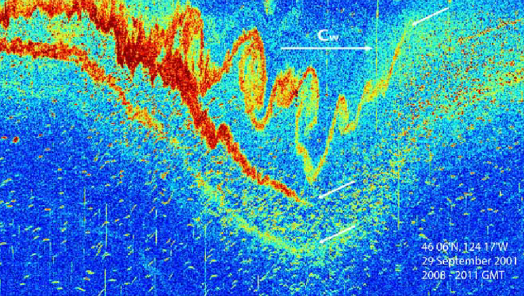
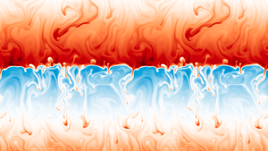

# Marine Turbulence
<!-- .slide: style="text-align: center; padding: 70px 0;"> -->
Ole Pinner

---

<!-- .slide: style="text-align: center;"> -->
<iframe width="750" height="500" src="https://www.youtube-nocookie.com/embed/dx60zMgrP8c?si=XigMQX2jLH0f9cK3&amp;controls=0&amp;start=270&amp;clip=UgkxFI5A1VWDtfoEXQW0F0Um66B-w0yU5rNk&amp;clipt=ELy5EBi3lhE" title="YouTube video player" frameborder="3" referrerpolicy="strict-origin-when-cross-origin" allowfullscreen></iframe>

---

# :x poem
Big whirls have little whirls  
that feed on their velocity,  
And little whirls have lesser whirls  
and so on to viscosity  
&nbsp;&nbsp;&nbsp;&nbsp;&nbsp;&nbsp; [Lewis F. Richardson, 1922](https://archive.org/details/weatherpredictio00richrich/weatherpredictio00richrich/page/66/mode/2up)

## What is turbulence anyway?
<!-- .slide: style="text-align: left;"> -->

It is hard to define turbulence precisely.    
But we can describe by (at minimum) the following properties:
 <!-- Inspired by and adapted from the lecture script of Umlauf and Burchard --> 
  1. **Random and chaotic**: Turbulence patchy and intermittent and can only be described statistically
  2. **Whirly**: Turbulent flows exhibit vortices, whirls, and eddying motions
  3. **Dissipative**: Energy is transported from [: large to small scales.](#poem) 

Turbulence is the main cause of diapycnal mixing (in contrast to horizontal/isopycnal sub-mesoscale stirring)

---

## What is causing turbulence?
<!-- .slide: style="text-align: left;"> -->
- Waves (Most important Internal Waves and Lee waves, but also surface waves.)
- Instabilities (shear, symmetric, baroclinic) 
- Double Diffusion

 

  

     <!--https://www.researchgate.net/publication/229061177_Structure_and_Generation_of_Turbulence_at_Interfaces_Strained_by_Internal_Solitary_Waves_Propagating_Shoreward_over_the_Continental_Shelf --> 
    
  

  

    <!-- https://en.wikipedia.org/wiki/File:Kelvin-Helmholtz_Instability.ogv --> 
    
  

  

    <!-- Ouillon2024 https://doi.org/10.1017/jfm.2020.527 --> 
    
  

 

---

## Why is it important for Climate Research?
<!-- .slide: style="text-align: left;"> -->

- Surface Mixing: carbon & oxygen exchange between atmosphere and ocean
- Bottom Mixing: upwelling, benthic life
- Interior Mixing: overturning circulation by transforing  water masses 

Much of the ocean interior mixing by internal waves happens over rough bathymetry or at the continental margins.

---

# :x internal waves
Dirk Olbers's magnum opus *Oceanic Internal Gravity Waves* is a preprint of currently over 500 pages. Shorter introductions are [*The lifecycle of topographically-generated internal waves*](vhttps://linkinghub.elsevier.com/retrieve/pii/B978012821512800013X), (Chapter 6 of the Book *Ocean Mixing*), [*Internal Tide Generation in the Deep Ocean*](https://doi.org/10.1146/annurev.fluid.39.050905.110227), [*Near-Inertial Internal Gravity Waves in the Ocean*](https://www.annualreviews.org/doi/10.1146/annurev-marine-010814-015746) for wind-generated internal waves, or [*Mixing by Oceanic Lee Waves*.](https://www.annualreviews.org/doi/10.1146/annurev-fluid-051220-043904)

## The problem with Internal Waves 
<!-- .slide: style="text-align: left;"> -->
But: Internal waves are a [:rabbit hole without bottom.](#internalwaves) 

<!-- MacKinnon2017 https://doi.org/10.1175/BAMS-D-16-0030.1 -->

---

# :x Umlauf2020
The TKE budget equation is taken from [eq 4.23](https://www.io-warnemuende.de/files/staff/umlauf/turbulence/turbulence.pdf#equation.4.3.23) of the lecture scripts by Umlauf and Burchard.
Assuming the flow is aligned with the x-direction and ignoring all horizontal gradients, the TKE budget can be simplified to the second equation ([eq 6.33](https://www.io-warnemuende.de/files/staff/umlauf/turbulence/turbulence.pdf#equation.6.4.33)). Sᵢⱼ is the shear tensor, 𝒯ₖ denotes the sum of all transport terms. These equations are a part from some different nomenclature equal to eq. 7.13 in *Ocean Mixing*, edited by Meredith and Naveira Garabato.

## How to quantify turbulence?
<!-- .slide: style="text-align: left;"> -->

Kinetic energy can be split into a mean and a fluctuating part (Reynolds-decomposition). One can then derive an euqation for the fluctuating part, the [:Turbulent Kinetic Energy (TKE).](#Umlauf2020)

$$
\frac{\partial \text{TKE}}{\partial t} + \frac{\partial \mathcal{T}_k}{\partial z} = P +G - \varepsilon
$$

- shear production $P$: conversion from mean-flow energy to TKE, and vice-versa
- buoyancy production $G$: in stable stratification, the conversion from TKE to potential energy
- dissipation rate $\varepsilon$: conversion to heat due to small-scale shear forces 

Turbulence is most often quantified as $\varepsilon$, the rate of energy lost to heat, which has the units $\mathrm{J}\,\mathrm{s}^{-1}\mathrm{kg}^{-1}=\mathrm{W}\,\mathrm{kg}^{-1}$.

---

# :x Osborn1980
With currently 1271 citations, one of the most influential and cited papers: [*Estimates of the Local Rate of Vertical Diffusion from Dissipation Measurements*](https://doi.org/10.1175/1520-0485(1980)010%3C0083:EOTLRO%3E2.0.CO;2)

# :x Gregg2018
[A 33 page review paper from 2018](https://doi.org/10.1146/annurev-marine-121916-063643), solely about mixing efficiency, concludes that 
"*Nonetheless, observations should continue to be scaled with 0.2 until observations, laboratory experiments, and numerical simulations converge on a more accurate formulation. In the meantime, published results should include as many parameters as possible to aid in understanding efficiency and allow subsequent recalculation of turbulent diffusivity.*" 

## Relation to Mixing
<!-- .slide: style="text-align: left;"> -->

An often used approximation is (turbulent) diapycnal diffusivity via Fickian diffusion and the [:Osborn relation](#Osborn1980). 

$\text{Tracer flux} = \frac{\partial}{\partial z} \left( \kappa_\rho \frac{\partial \substack{\text{Tracer}\newline \text{density}}}{\partial z} \right)$ with $\kappa_\rho = \varGamma \frac{\varepsilon}{N^2}$

$$
\text{\small mixing efficiency }\varGamma := \frac{\substack{\text{\small change in background potential energy}\newline \text{\small due to mixing}}}{\text{\small Energy expended}} \approx 0.2 
$$
We are sure $\varGamma$ is <a data-preview-image="/images/efficiency.png"> not constant</a>, but varies by order of magnitudes. But we also have no consistent theory, so we are still often use [:a value from the 80s.](#Gregg2018)

---

# :x observations
For example eddy covariance or Particle Image Velocimetry

# :x models
So called Direct numerical simulation (DNS) of the Navier Stokes equations. 

## Estimating marine turbulence from observations
<!-- .slide: style="text-align: left;"> -->

Very few [:observational methods](#observations) or [:numerical models](#models) can resolve turbulent scales directly:
- General need for parameterizations (in models and observations)
- Parameterizations from observational data range from more to less trustworthy, dependent on their measured scales.

Vertical profiles:
  - Microstructure: Shear variability on Millimeter scales(often THE gold standard)
  - Finestructure: Shear variability on Meter scales
  - Overturns: Unstable segments on 1-100 Meter scales  

ADCP:  
  - structure function: Velocity variability on meter scales

---

# :x passive
Meaning, mixing does not change how the ocean adjusts to changes in climatic forcing. 
Diffusive coefficients in models are often prescribed and not dynamically adjusted. But recent findings indicate otherwise. Many fast interactions between mixing processes and large scale behavior were found ([Meredith2022, Chapter 1 and references therein](https://doi.org/10.1016/C2019-0-03674-6))

# :x artemics
Development of a parameterization of internal waves in the Arctic Ocean and use in climate models to research links and feedback mechanisms between declining sea ice, wave-induced mixing, stratification and heat transport. 

### What are current research questions?
<!-- .slide: style="text-align: left;"> -->

- Ocean mixing is almost always described as [:dynamically passive.](#passive). A better representation of turbulence/ mixing in numerical models may be needed to accurately forecast changing polar oceans. 

- @AWI: new [:Emmy Noether group Artemics](#artemics) in Climate Dynamics by Friederike Pollmann

---

## Some quotes at the Ends
<!-- .slide: style="text-align: left;"> -->

"The single paper motivating the most comments, experiments, and disquiet in a lot of readers was Garrett and Munk, 1972. The paper is a virtuoso orchestration of synthesis, approximation, boldness, normalization, and implication." (Briscoe, 1975, cited in Polzin et al, 2011)

"Although there has been a large range of deeply insightful research contributions to our understanding of transition, turbulence, and irreversible mixing in stratified fluids, it still remains extremely difficult to say anything generic about mixing." (Caul et al., 2021)

"The trends in mixing are difficult and, in many cases, nearly impossible to assess." (Bennetts et al., 2024)

---

## Recommended Literature
<!-- .slide: style="text-align: left;"> -->

- [Lecture notes by Lars Umlauf and Hans Burchard, 2020](https://www.io-warnemuende.de/files/staff/umlauf/turbulence/turbulence.pdf)
- [*Ocean mixing: drivers, mechanisms and impacts*, Meredith & Naveira Garabato et al., 2022](https://doi.org/10.1016/C2019-0-03674-6)
- [*An Introduction to Ocean Turbulence*, Thorpe 2007](https://www.cambridge.org/core/product/identifier/9780511801198/type/book)
- [*The Turbulent Ocean*, Thorpe 2005](https://doi.org/10.1017/CBO9780511819933)
- [*Instability in Geophysical Flows*, Smyth & Carpenter](https://directory.doabooks.org/handle/20.500.12854/90836)

Also interesting:
- [*The Study of Mixing in the Ocean: A Brief History*, Gregg 1981](https://doi.org/10.5670/oceanog.1991.21)
- [Video: *Why 5/3 is a fundamental constant for turbulence*](https://www.youtube.com/watch?v=_UoTTq651dE)

